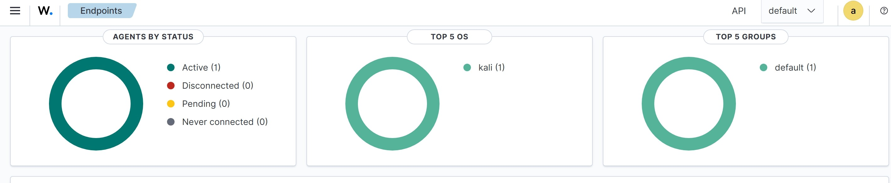
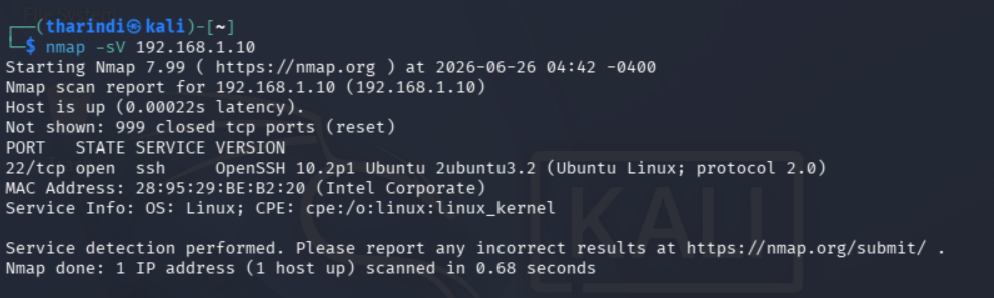
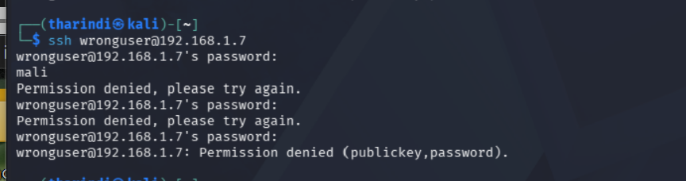
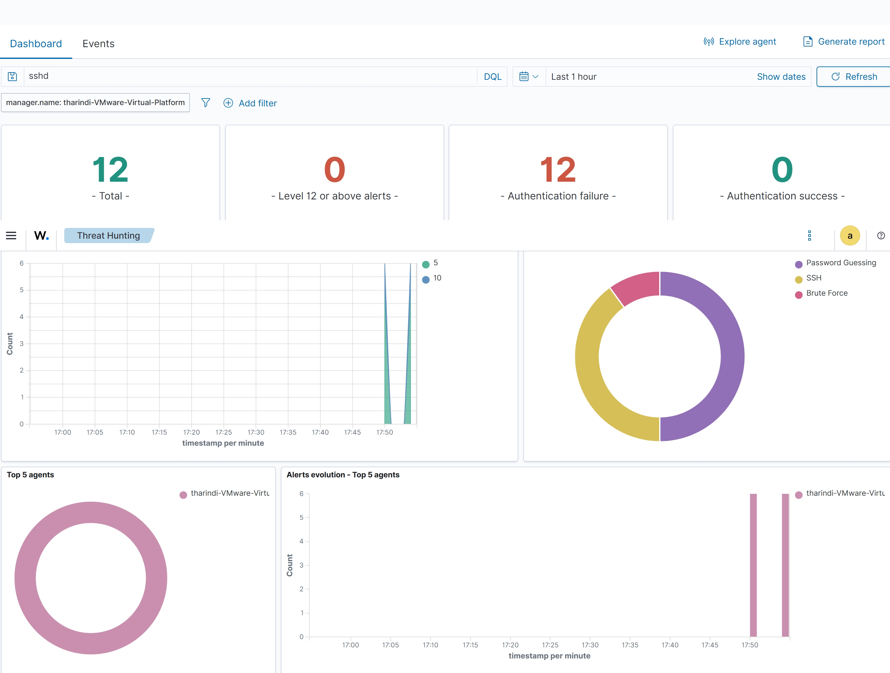
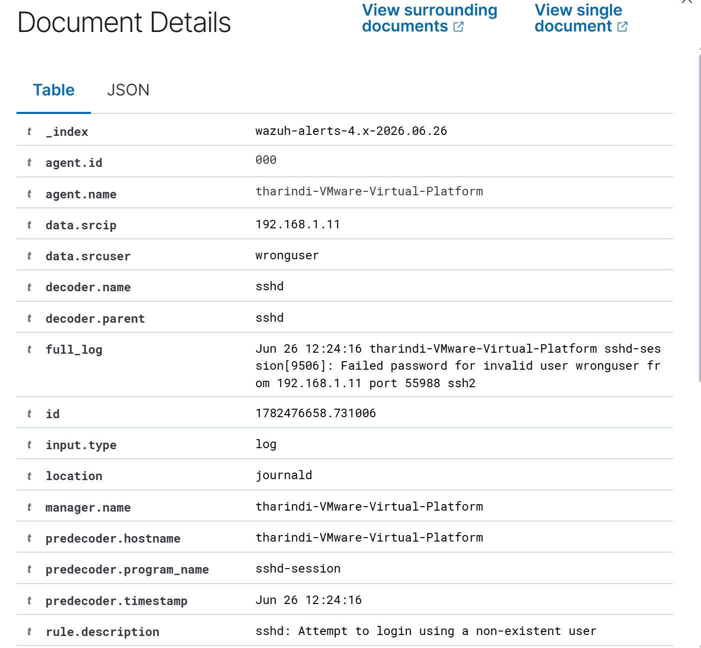
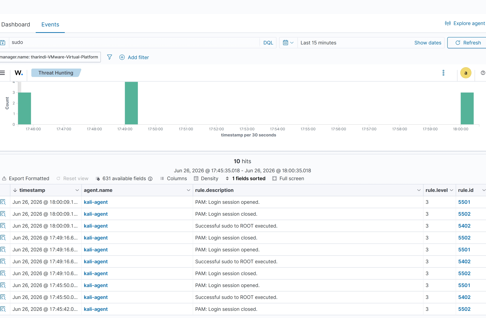
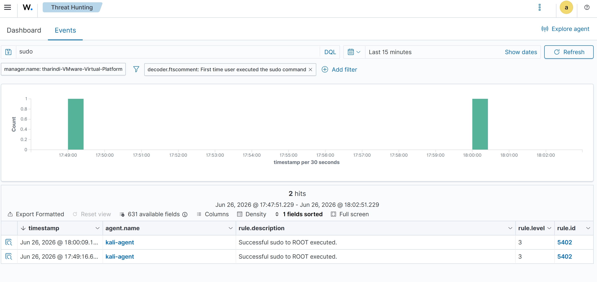
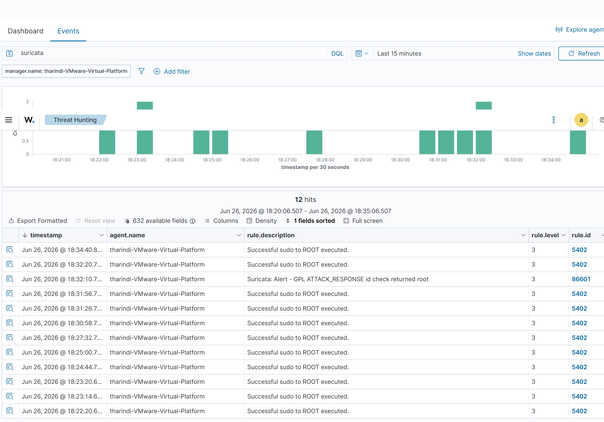
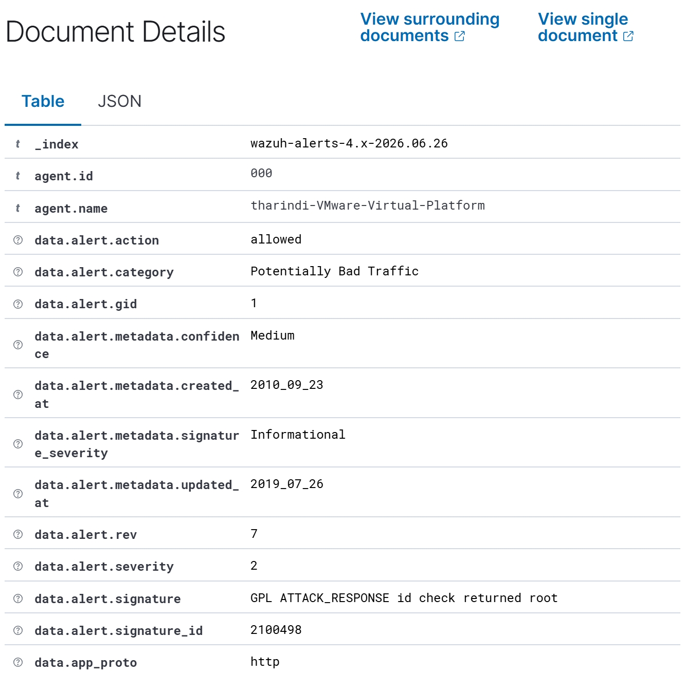
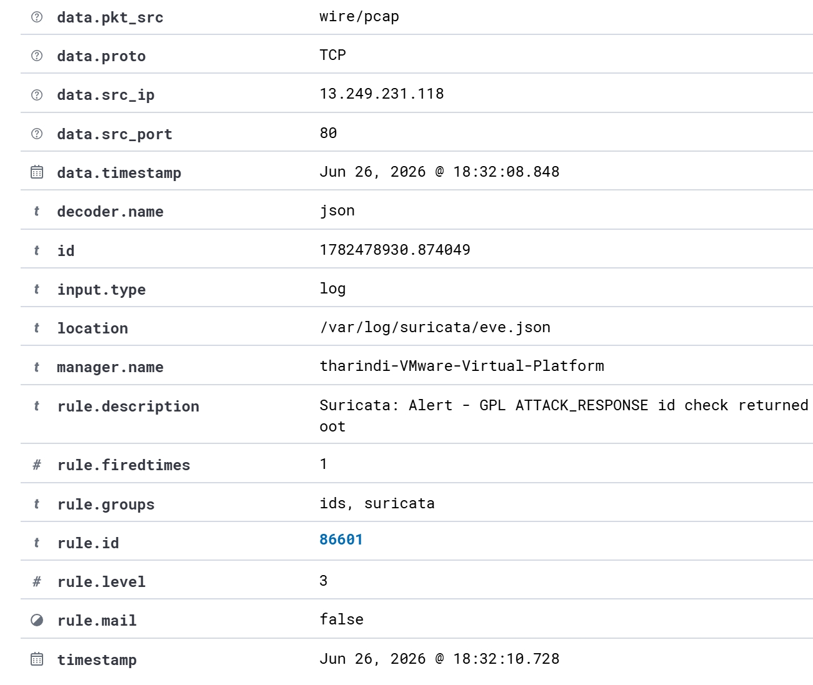

# SentinelLab: SOC Monitoring Lab with Wazuh and Suricata

SentinelLab is a beginner SOC monitoring lab created to practice blue-team security monitoring, log analysis, and alert investigation using Wazuh and Suricata.

## Lab Overview

This project simulates basic security monitoring use cases in a local virtual lab. Kali Linux was used as the test machine, while Ubuntu was used as the Wazuh server, SSH target, and Suricata IDS machine.

## Tools Used

- Wazuh
- Suricata
- Ubuntu Linux
- Kali Linux
- Nmap
- OpenSSH

## Lab Architecture

```text
Kali Linux
Attacker / Test Machine
IP: 192.168.1.11

        ↓

Ubuntu Linux
Wazuh Server + Suricata IDS + SSH Target
IP: 192.168.1.7
```

## Objectives

- Build a basic SOC monitoring lab.
- Deploy Wazuh for log monitoring.
- Connect Kali Linux as a Wazuh agent.
- Detect failed SSH login attempts.
- Monitor sudo activity from Kali.
- Integrate Suricata IDS alerts with Wazuh.
- Document alerts with screenshots.

## Screenshots

### 1. Wazuh Dashboard Overview


### 2. Kali Agent Active



### 3. Nmap Scan Showing SSH Open



## Use Case 01: SSH Failed Login Detection

### Scenario

A failed SSH login attempt was generated from Kali Linux against the Ubuntu server using a non-existing username.

### Test Command

```bash
ssh wronguser@192.168.1.7
```

### Evidence







### Detection Details

Wazuh detected the failed SSH login attempt and showed:

- Source IP address
- Invalid username
- SSH decoder
- Authentication failure
- MITRE ATT&CK mapping

MITRE ATT&CK techniques:

- T1110.001 Password Guessing
- T1021.004 SSH

## Use Case 02: Sudo Activity Detection

### Scenario

Sudo activity was generated on Kali Linux and detected by Wazuh through the connected Kali agent.

### Test Command

```bash
sudo cat /etc/shadow
```

### Evidence





### Detection Details

Wazuh detected successful sudo activity from the Kali agent.

Example alert:

```text
Successful sudo to ROOT executed.
```

## Use Case 03: Suricata IDS Alert Detection

### Scenario

Suricata was installed on Ubuntu and configured to monitor network traffic. A test IDS alert was generated using `testmynids.org`.

### Test Command

```bash
curl http://testmynids.org/uid/index.html
```

### Evidence







### Detection Details

Suricata generated an alert and Wazuh collected it from:

```text
/var/log/suricata/eve.json
```

Example alert:

```text
Suricata: Alert - GPL ATTACK_RESPONSE id check returned root
```

Alert information included:

- Event type
- Source IP
- Destination IP
- Protocol
- Alert signature
- Alert category
- Rule ID
- Log location

## Key Learnings

Through this lab, I practiced:

- Setting up a basic SOC monitoring environment
- Connecting endpoints to Wazuh
- Reading SSH authentication logs
- Detecting failed login attempts
- Monitoring sudo activity
- Integrating Suricata IDS alerts with Wazuh
- Investigating alerts using Wazuh Threat Hunting
- Documenting security evidence clearly

## Project Status

Completed:

- Wazuh dashboard setup
- Kali Wazuh agent connection
- SSH failed login detection
- Sudo activity detection
- Suricata IDS alert integration
- Screenshot-based evidence documentation

## Disclaimer

This project was created in a private local lab environment for educational purposes only. All testing was performed on systems owned and controlled by me.
